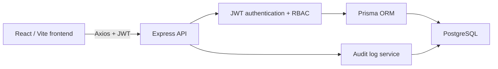
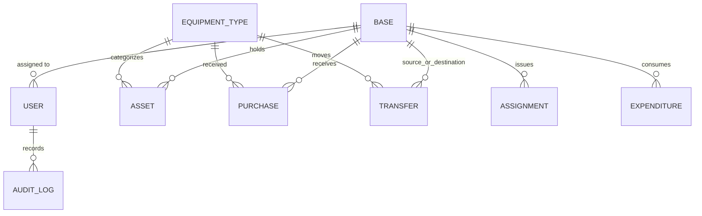

# Sentinel Asset Command — Implementation Report

## Architecture

The React client stores the JWT session locally and protects routes in the browser. The Express API remains the authorization authority: it validates JWTs and injects the assigned base into every Base Commander query. The frontend's demo fallback exists only to make the static preview usable before an API URL is provisioned.

## Relational data model

`Asset` is the current stock table, uniquely keyed by `(baseId, equipmentTypeId)`. `Purchase`, `Transfer`, `Assignment`, and `Expenditure` are immutable movement records. Their composite indexes support base/equipment/date reporting. The dashboard calculates balances from those historical events; no dashboard totals are persisted.

## Integrity controls

- Transfers run as a Prisma `Serializable` transaction.
- The source balance is reduced with an atomic `updateMany` condition requiring `quantity >= requested quantity`; failed checks return HTTP 409.
- A destination asset is created or incremented in the same transaction.
- Each stock mutation adds an `AuditLog` record through one service before commit.
- Foreign keys use restrictive deletes for transactional history and cascading deletes only for a base's live stock record.

## Authorization matrix

| Capability | Admin | Base Commander | Logistics Officer |
| --- | --- | --- | --- |
| View dashboard / inventory | All bases | Assigned base only | All bases |
| Record purchase | Yes | Assigned base only | Yes |
| Initiate transfer | Yes | No | Yes |
| Assign / expend | Yes | Assigned base only | No |
| View audit trail | Yes | No | No |

## Demo walkthrough outline (3–5 minutes)

1. Sign in as `admin_user`; show dashboard filters and the Net Movement detail modal.
2. Record a purchase and show the resulting stock and audit update.
3. Sign in as `logistics_officer`; create a cross-base transfer and explain the atomic source/destination update.
4. Sign in as `commander_alpha`; show that base selection is locked to Fort Alpha and log an assignment or expenditure.
5. Return as admin to show the central audit trail and describe the Prisma/PostgreSQL deployment path.
